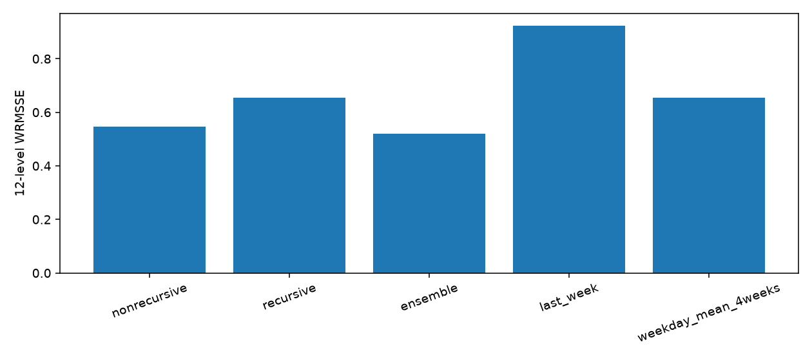
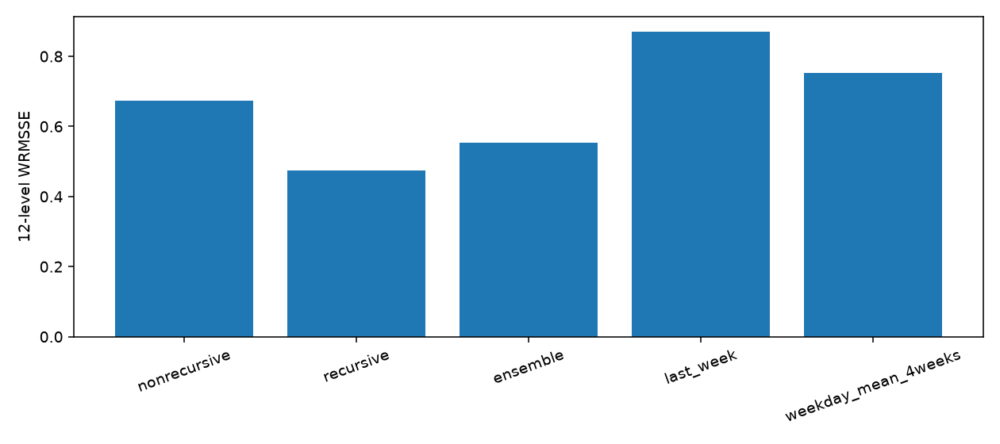
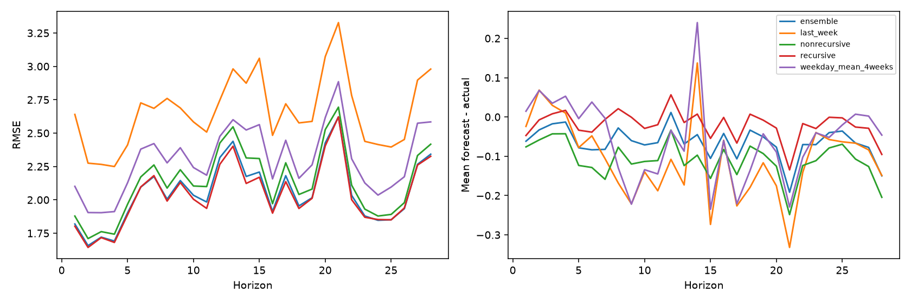

# M5 全量实验结论汇总

完成时间：2026-10-02 13:20:58（中国时间）。60/60 个模型全部完成。
覆盖全部10店、30,490条商品—门店序列；每阶段20个模型，三阶段累计60个。每模型固定3000轮，4 CPU线程，串行运行。

## 最重要的结论

1. 开发窗口中等权融合最好，WRMSSE=0.520435；最后测试窗口中递归最好，WRMSSE=0.474617。
2. 融合在两个窗口都优于两个简单基线，但不会总胜过最好的单模型；本次最终仍遵循开发后冻结的50:50融合，没有看完最后测试再改权重。
3. 当前20个按店模型已完整覆盖全部商品，不需要220个模型才能产出全量预测。
4. 最终28天预测没有提供真实标签，其准确度未知；已通过完整性检查。以上分数是本地样本外回测，不是Kaggle榜单分数。

## 两个回测窗口

开发训练d1–1885，预测d1886–1913（2016-03-28至2016-04-24）。
最后测试训练d1–1913，预测d1914–1941（2016-04-25至2016-05-22）。
两者均为30,490条底层序列上的相同28天窗口；WRMSSE包括12层级，越低越好。

|方案|开发WRMSSE|最后测试WRMSSE|开发RMSE|最后测试RMSE|
|---|---:|---:|---:|---:|
|非递归|0.545306|0.673919|2.101301|2.148014|
|递归|0.654625|0.474617|2.110186|2.053672|
|等权融合|0.520435|0.553158|2.067119|2.071558|
|最后一周重复四次|0.922781|0.869701|2.759459|2.676895|
|最近四周同星期均值|0.654648|0.752421|2.278347|2.313961|

融合相对最近四周同星期均值的WRMSSE降幅：开发 20.50%，最后测试 26.48%。

## 预测偏差与指标解释

|方案|开发总销量偏差|最后测试总销量偏差|
|---|---:|---:|
|非递归|-2.81%|-7.56%|
|递归|7.44%|-1.42%|
|等权融合|2.32%|-4.49%|

偏差=预测−真实；负数表示低估，正数表示高估。最后测试中非递归偏低7.56%，递归偏低1.42%，融合偏低4.49%。
MAE/RMSE评价底层逐条误差，WRMSSE强调层级汇总及销售金额，所以排名可以不同：最后测试融合MAE更低，但递归WRMSSE更低。
两个窗口模型名次变化明显，后续应在更早窗口做滚动验证；不据最后测试反复挑权重。

## 最终输出

最终训练使用截至d1941的全部已知销量，预测d1942–1969（2016-05-23至2016-06-19）。
- `final/ensemble.csv`：主要交付，30,490行，F1–F28。F1对应2016-05-23，F28对应2016-06-19。
- `final/recursive.csv`、`final/nonrecursive.csv`：两单模型预测。
- `final/kaggle_ensemble.csv`：60,980行，validation段填真实最后测试回测，evaluation段填最终预测，按sample_submission顺序，无占位零；没有提交Kaggle。

最终融合预测28天总销量约 1,267,545 件；非递归约 1,225,747 件，递归约 1,309,342 件。这些都是预测值。

## 完整性与指标核对

本次整理时重新读取全部最终预测：ID唯一、与原始数据完全一致，30,490×28、10店全覆盖，无缺失/无无穷/无负数。
Kaggle文件的60,980个ID与样例顺序一致，两个日期段逐值核对等于真实回测与最终融合预测。
回测各层级共42,840条序列，两个窗口没有正权重且零缩放项的序列。原版26个文件SHA-256核对通过。
WRMSSE缩放从首次非零起计算相邻日差平方均值，权重取训练截止日前最后28日销售金额，各层归一后等权平均。
手算和独立外部参考核对通过，外部最大逐层差1.11e-16；证据在wrmsse_reference_check.json。

## 主要特征和耗时

最终非递归最重要的是滞后28日的30日均值、商品×州训练均值、滞后28日的14日均值。
最终递归最重要的是从前1日起的7日/14日/30日滚动均值，体现近期销量及逐日回填的作用。gain是模型内部重要性，不代表因果关系。

日志日期时间总历时约20.72小时；60模型累计训练计时20.10小时；单进程峰值RSS约5.28 GiB。
模型耗时使用单调时钟，日志历时使用日期时间，二者可能受系统时钟校正产生差异，不应把累计子进程耗时当精确的墙钟时间分解。
`all_timings.csv`包含每阶段、门店和模式的训练/预测/总计耗时。

## 怎么查看

在本机 `D:\香港学习相关文件\5054-miniproject\M5-results` 双击 `结果总览.html`，可以切换回测窗口、误差指标，查看门店/品类/步长误差、最终销量、特征重要性与文件入口。
`development/`和`test/`含scores.csv、error_analysis.csv、12层明细与PNG图；`final/`含最终预测与重要性。
原始完整实验目录：`~/projects/m5-forecasting/experiments/time_validation_v2/`。
Windows入口：`\wsl.localhost\Ubuntu-24.04\home\cyangcj\projects\m5-forecasting\experiments\time_validation_v2`。
这个D盘结果文件夹是方便查看的交付副本，未迁移WSL；模型和缓存仍在原来的WSL虚拟磁盘中。

## 仍有的局限和下一步

只验证两个时间窗口，尚未证明全年稳定性；没有预测区间；未来价格/日历采用比赛已知外生信息设定。
保留原版上市前训练行过滤；训练行目标编码使用训练期整体统计、包含自身标签，没有交叉拟合编码。
没有重现冠军220模型全部分组；没有Kaggle评分。本地样本外流程已建立，可作为后续模型扩展的可靠基准。
后续优先顺序：更多更早滚动窗口 → 独立GPU同配置测速 → 视开发验证收益增加30个门店×品类非递归模型。

## 评分与图表证据

